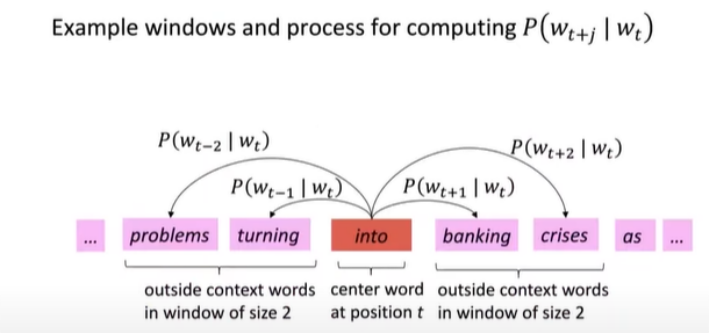
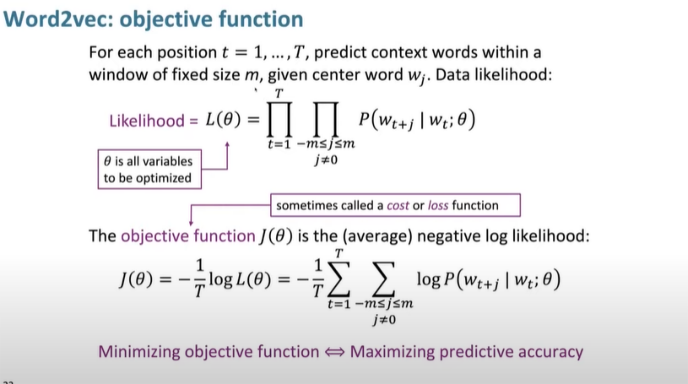
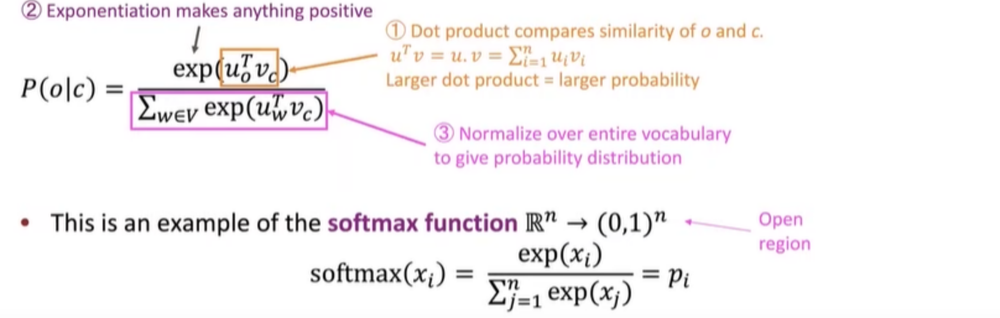

# Lecture 1 (Intro to WordVectors) -

(Language is a glorious chaos). Single biggest achievement - GPT-3. \...
how it predict words WOAH. translating human languages to SQL. GPT-3
really knows a lot about the meaning of language.

What is meaning -

signifier (symbol) \<=\> signified(idea) also called denotational
semantics. Traditionally, they make use of dictionary (WordNet) contains
lists of synonym sets and hypernyms. wordnet is a nice resource but
highly deficient. (Lacks neurons), misses new meanings of words. also
requires human labor to create and adapt. Problem with tradiational nlp
is that words are regarded as discrete symbols. (Localist
representation). Then each one is a one-hot vector. Vector dimension =
number of words in vocab. bigger problem is that we dont have a notion
for similarity for one-hot vectors. Then there is no similarity in motel
and hotel which is not convenient.

Modern way is - Distributional semantics - A word\'s meaning is given by
the words that frequently appear close-by. when a word x appears in a
text, its context is the set of words that appear nearby. the context
words represent the word x. banking as a type is diff from banking as a
token.

Word Vectors -

for each word type we have a word vector (Distributed representation) -
word embeddings as these representations place themselves in a higher
dimensional vector space. how we group together similar words.

Word2vec - framework for learning word vectors

idea: have a large corpus \"body\" of text, choose a fixed vocabulary
that in which every word is represented by a vector. Then we want to
work out what a good vector for each word is. Go through each position t
in text whcih has a center word c and context words o.

Then we can use the similarity of word vectors for c and o to calculate
the probability of o given c (or vice-versa). Keep adjusting the word
vectors to maximize this probability.

the larger the dot product the larger the probability. normalize over
entire vocab to give probability distro. (softmax function). softmax
maps arbitrary values x_i to a probability distro p_i. max because
amplifies probability of largest x_i and soft because still assigns some
probability to smaller x_i. very frequently used in deep learning.

we want to optimize value of parameters to minimize loss. maximize the
probability for the words we actually saw in context of center words.
for each word, we have 2 vecs. context and center. (maximize the
prediction of context words). Take the max we saw previously and work
out where he gradient is to walk down the hill with minimal loss and
improve our model.

JUST WOAH!!!! word vectors are soo cool. With the gensim vector
visualization script on jupyter you can pretty much subract vectors and
get an analogy. you give in (man, king, woman) and the result would be a
queen. you give it (pencil, sketching, camera) and get photography!!!
woah. using datasets and then the word vector library gensim lets u do
all type of arithmetic. we can do all sorts of analogies like tall to
tallest and gets long to longest. These methods were first developed it
was super cool. Thats why word vectors are just SOOO powerful for
getting the word meaning.

How do you pick 2 vectors for each word? In the objective function, you
take the sum over every word that appears as a center words and then the
sum for each word as a context word. So you have a particular context
word for each center word and then you sum it all up. if the context is
same as center word the derivative gets really complex. taking separate
vectors this never happens so thats why we use 2 vectors.

we take all meaning of words liek \'star\' we just put it in a single
vector. WOAH wouldnt that cause problems? why does it now? guess ill
know next lecture.
